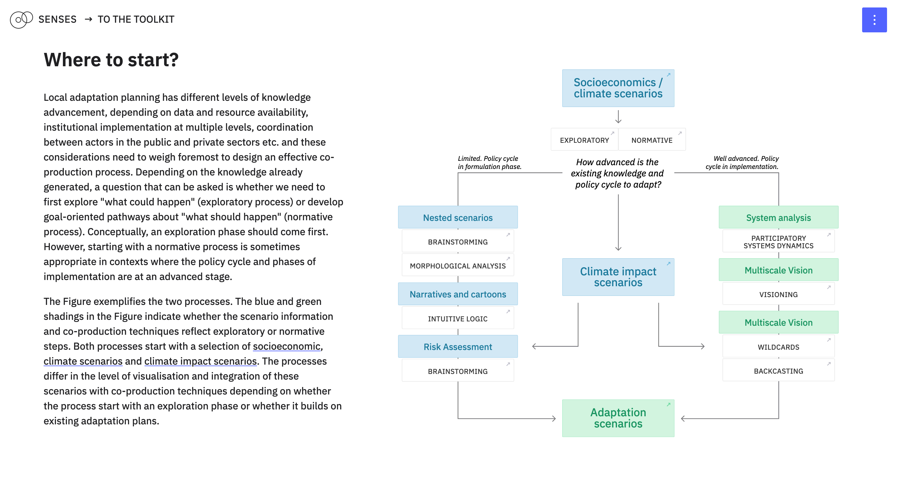
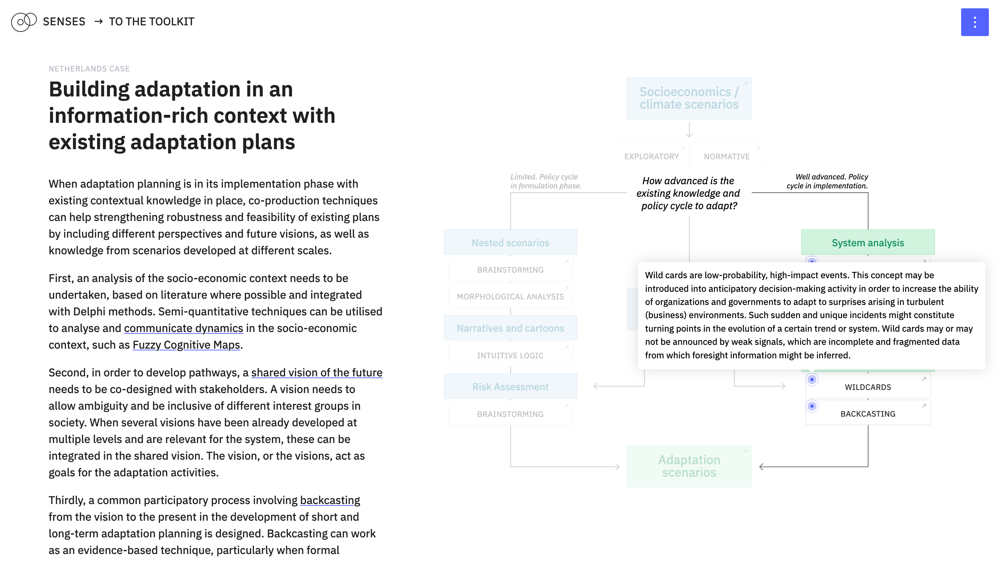

# Developing robust adaptation in co-production with stakeholders

Simona Pedde, Sara Talebian, Lotte de Jong, Kasper Kok, Henrik Carlsen and Jonas Parnow

While global scenarios inform country-scale decarbonisation plans and targets, in line with the Paris Agreement, adaptation to climate change is often implemented locally with potential trade-offs related to uneven impacts on livelihoods, winners and losers from the transition and interests playing at different policy levels. This Learn Module explores how to utilise co-production techniques to engage stakeholders in the development and implementation of robust adaptation plans, compatible with both local agendas and informed by global climate scenarios. Within SENSES, global products importantly including socioeconomic scenarios, could also encompass climate change projections or impact modelling. A key feature of the approach is to integrate knowledge developed bottom-up from existing local scenarios and adaptation plans with information from global scenarios. We illustrate how co-production techniques complement each other in a stepwise manner with concrete examples from two cases in Kenya and the east of the Netherlands.

This Learn Module is targeted at stakeholders interested in co-developing adaptation plans making use of global scenarios, and the broader community of scenario practitioners.

---

This repository contains the code for [*Co-producing adaptation options to address future cross-border climate impacts*](https://climatescenarios.org/co-production/). It is part of the [SENSES Toolkit](https://climatescenarios.org/).




## License

The source code is licensed under the [ISC license](LICENSE.md). Text and graphics are licensed under [Attribution-ShareAlike 4.0 International](https://creativecommons.org/licenses/by-sa/4.0/).

## Build Setup

```bash
# install dependencies
$ npm install

# serve with hot reload at localhost:3000
$ npm run dev

# build for production and launch server
$ npm run build
$ npm run start

# generate static project
$ npm run generate
```

For detailed explanation on how things work, check out [Nuxt.js docs](https://nuxtjs.org).
